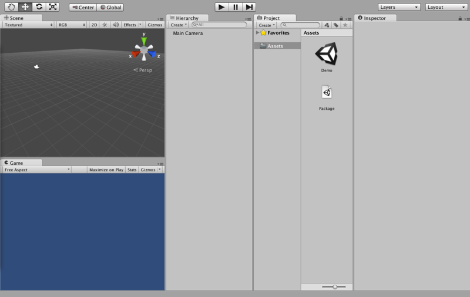
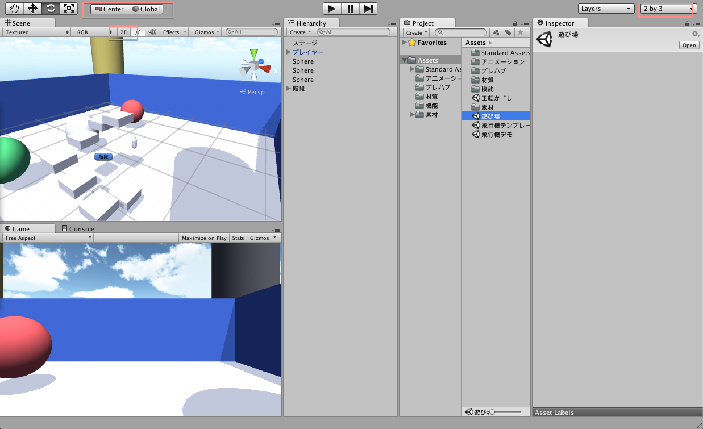
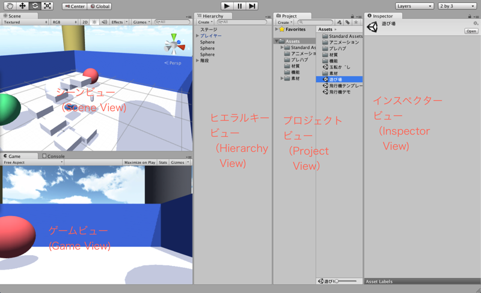
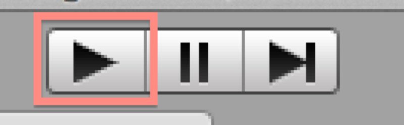
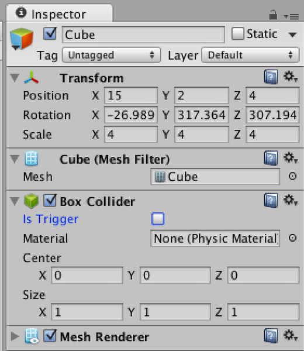
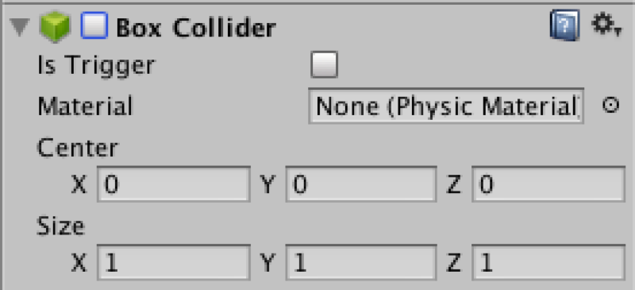
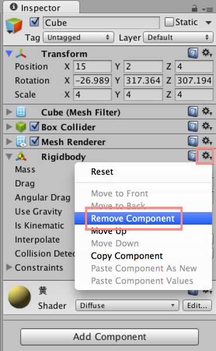
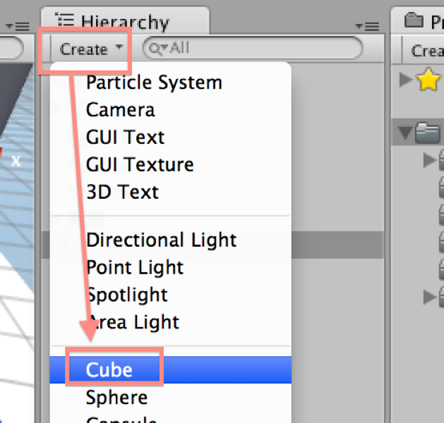

#操作を覚えよう

Unityのゲームを作る前に、一度Unity Editorの使い方に慣れよう。

##プロジェクトの開き方

*  添付のZipファイルをダウンロードして展開します。
*  展開したファイルを、C:¥Unity フォルダへ移動します。
*  展開したファイルの中を確認し、Assets/遊び場.unity を開きます。

しばらくするとUnityエディタが起動し、以下の様な画面になります。

画面の配置が一致しない人のため、画面を一致させます。

*  Layoutを 「2 by 3」へ
*  左上の項目はCenterかつGloval
*  2Dにはチェックが入っていないこと。

##画面説明

画面について説明します。

Unityの画面はSceneView・HierarchyView・GameView・InspectorView・ProjectViewの5つで構成されます。この各画面を使ってゲームを構築していきます。

各項目の説明は下に書きますが、基本的に以下のように認識していればOKです。

*  SceneViewは仮想空間内を表示
*  HierarchyViewはSceneViewの中のオブジェクト一覧表示
*  Inspectorはオブジェクトの機能一覧表示
*  GameViewはカメラ（特別なオブジェクト）が撮影したものを表示
*  Project Viewはフォルダ・ファイルの管理

###Scene Veiw
Scene View (シーンビュー)と読みます。

シーンビューを説明する前にシーンについて説明します。シーンとはUnityのゲーム開発の基本で、ゲーム内の世界を指します。

シーンビューはこの仮想空間を眺める窓です。ゲーム開発社はシーンビューよりシーン内に構築されるゲームを眺め・調整しながらゲームを開発することが出来ます。

###Hierarhy View
Hierarchy View（ヒエラルキー・ビュー）と読みます。

ヒエラルキーはシーン内に配置したオブジェクトを階層的に表示したビューです。この項目から選択する事で、ゲーム内に散らばった様々なオブジェクトに簡単にアクセスすることが出来ます。

またオブジェクトの親子構造を表現する際にも使用されます。

###Game View
Game View（ゲームビュー）と読みます。

ゲームビューは、カメラの機能を持つCameraコンポーネントが撮影した画面です。この撮影結果はそのままゲーム画面となります。

###Inspector View
Inspector View（インスペクター・ビュー）と読みます。

この項目は、ゲームオブジェクトが持つ振る舞い・機能の一覧を確認することが出来ます。また、振る舞いの調整等もインスペクタービューより行います。

###ProjectView

ProjectView（プロジェクトピュー）と読みます。

ProjectViewはWindowsで言う所のフォルダ管理に該当します。
下のバーを動かすことで、サムネイル表示と一覧表示を切り替えが可能です。

##SceneViewの操作方法

Unityでゲームを作成する際には、特にSceneViewの操作が重要になってきます。そのためSceneViewの操作はキッチリ抑えておきましょう。

前述した通りSceneViewはシーン（仮想空間）を覗く窓です。ゲーム画面とは異なる専用のカメラマンが居て、そこに描画している事をイメージして下さい。

カメラの操作方法は以下のとおりです。

*  マウスホイール　：カメラが前進・後退
*  マウス右ボタンを押しながらスクロール：カメラを回す
*  マウス真ん中を押しながらスクロール：カメラを平行移動する
*  対象のオブジェクトをクリック：クリックしたオブジェクトを選択する
*  オブジェクト選択中にFキー　：　オブジェクトの近くに寄る

では、実際にシーンのカメラを動かしてみましょう。
開いたシーンには「３つの玉」や「４つの塔」、それと階段らしき物があります。これらの周りをカメラで周り・オブジェクトの内容をよく確認して下さい。

また、オブジェクトを選択し、InspectorViewやHierarchyViewに変化がある事を確認して下さい。

##Gameの実行方法

ゲームを実行するためには、画面上の再生ボタンをクリックします。ゲームを再生すると、GameViewの中で視界が動き始めます。

このゲームの操作は以下のとおりです。

* 　マウスを動かす：視界を動かす
* 　十字キー：上下左右に動く
* 　スペース：ジャンプ

では実際にゲームを再生し、ステージを動きまわってみましょう。

SceneViewに注目して下さい。プレイヤーを動かした際、カプセル状の物体が動いていることがわかります。実はこのカプセル状の物体はプレイヤーです。

ゲームを再生すると、シーン内のオブジェクトが割り当てられたプログラムに従い動き始めます。例えばカプセル状の物体（Hierarchyでは「プレイヤー」と表示）は、移動したりカメラを操作する機能を持っています。

なお、ゲームの再生を停止するには、もう一度「再生ボタン」をクリックします。
この際に先ほど散々移動した「プレイヤー」が初期位置に戻っていることが確認出来ます。見逃した場合はもう一度再生→動かす→停止で確認してみましょう。
ゲームの再生を停止させると、Unityエディタはゲーム再生前の状態に巻き戻します。これは、Unityエディタを操作する上で非常に重要なので覚えておきましょう。

##オブジェクトのパラメータを確認する

では、オブジェクトに割り当てられた機能やパラメータを確認しましょう。オブジェクトの内部を確認するには、InspectorViewを使用します。

先ほども確認したとおり、オブジェクトを選択するとInspectorViewにオブジェクトの持つパラメータが表示されます。

まず一番上にオブジェクトの名前、Transformは座標や回転についてを表示します。その下はオブジェクトの持つ機能が表示されます。例えば「Cube（箱）」を選択すると、「Transform(座標)」や「Box Collider（ボックスの当たり判定）」、「Mesh Renderer（箱を描画する機能）」が付随している事がわかります。

では、実際にこのパラメータを使用してボックスの位置を変更してみましょう。
（この際、巻き戻しやすいように、ゲームを再生してから色々と試してみましょう。ゲームが再生中であれば、ゲームを停止した際に全て元通りになりますので、恐れずトライしてみましょう）

まず名称を分かりやすく「ボックス」とします。InspectorViewのCubeを選択して箱に変更・エンターで確定します。

Transofrmはオブジェクトの座標を表現しますPositionは座標、Rotationは回転、Scaleは大きさです。xが横、yが縦、zが奥と考えて下さい。

例えばxを10にしたり、yを6にしたり、大胆に変更を加えてみましょう。なお、数値のxやyやzの上にマウスを置くと、カーソルが変化します。このタイミングでマウスを押しながらマウスを移動させると、値をスムーズに変更させる事が可能です。

Box Colliderの隣のチェックボックスを外してみてください。こうすると、ボックスの当たり判定の機能が失われ、ボックスの中に入り込むことが可能になります。Mesh Rendererのチェックを外すと、ボックスの描画能力が失われ、描画されなくなります。

地面の当たり判定を抜いたり、絵が無いのに当たり判定だけある状態などなど、色々と試してみてください。

なお、このオブジェクトに付与されている機能やプログラムの事を総称で「コンポーネント」と呼びます。

##オブジェクトの操作方法

前回はオブジェクトの移動や設定をInspectorViewから行いましたが、今回はScenViewから直感的に行います。

SceneViewからは、ツールチップを使用することで、対象のオブジェクトを回転させたり、引き伸ばしたり、移動させたりする事が出来ます。

この状態で操作を巻き戻したいと思ったら、Ctrl+Zで1個操作をやり直す事ができます。

###移動モード

移動モードでは選択中のオブジェクトの座標を変化させます。

移動モード中はオブジェクト選択時、赤・緑・青の3本の矢印が表示されます。この矢印を選択しながらマウスを移動すればオブジェクトが矢印の軸の方向へ移動します。例えば、上を向いている矢印（多分緑色）を選択しながらドラッグすると、オブジェクトは上下に動きます。

移動モードの状態で、矢印ではなくオブジェクトを選択しながらマウスを動かすと、方向に関係なく自由に移動させることが出来ます。

###回転モード

回転モードではオブジェクトの向きを変更します。

回転モード中はオブジェクト選択時、赤・緑・青の3本の輪が対象のオブジェクトを囲っています。この線を選択しながらマウスを移動すれば、その方角へオブジェクトが回転します。例えば、緑の輪を選択しながら左右に動かすと、オブジェクトが左右に回転する事がわかります。

回転モードの状態で、輪ではなくオブジェクトを選択しながらマウスを動かすと、方向に関係なく自由に回転します。

###拡大縮小モード

拡大縮小モードでは、オブジェクトの大きさを変更します。

拡大縮小モード中はオブジェクト選択時、赤・緑・青の3本の棒がオブジェクトから突き出ます。このオブジェクトを選択しながらマウスを動かすと、オブジェクトはその方角へ伸びます。例えば緑の棒を伸ばすと、その方角へ伸びる事が分かります。

なお、中央の四角を選択すると、オブジェクトを均一に大きく/小さくする事が出来ます。

##コンポーネントの追加・削除

オブジェクトにコンポーネントを追加・削除します。今回も巻き戻しやすいようにゲームを再生しながら操作していきましょう。

コンポーネントは以前説明したとおり、オブジェクトに機能を与えます。コンポーネントを追加する事でオブジェクトは新しい機能を得て、コンポーネントを削除する事でオブジェクトは機能を失います。

では、黄色いCubeに機能を追加してみましょう。

*  まず黄色いCubeを選択します。
*  InspectorViewを確認し、画面下の方のAdd Componentを選択します。
*  Physicsを選択し、Rigidbodyを選択します。

こうする事で、今まで宙に浮いていたオブジェクトが落下し、地面に転がりました。この状態でシーンビューから上に持ち上げても、残念ながら浮く事は無く落下します。
Rigidbodyは「物理演算」の機能を追加するコンポーネントです。つまりCubeに物理演算が加わり、物理の法則に従い落下し始めたと言うことです。

次に黄色いCubeからRigidbodyの機能を消しましょう。

*  Rigidbodyコンポーネント右の歯車のマークをクリックします。
*  Remove Component(コンポーネントを削除の意味)をクリックします。

これでコンポーネントが削除されました。InspectorViewからも削除された事が確認できたと思います。実際に持ち上げて物理演算が働かない事を確認してみてください。

##オブジェクトを作ろう

そろそろオブジェクトを実際に作り、ステージに物を追加してみましょう。オブジェクトを新しく作る操作は、HierarchyViewから行います。

実際にやってみましょう。

*  HierarchyのCreateを選択
*  Cubeを選択

これで、新しくCubeが生成されました。

この操作では色々なオブジェクトを作成することが出来ますが、とりあえず以下の4種類を覚えておいて下さい。

*  Cube : キューブ（箱）
*  Sphere : スフィア（玉）
*  Capsul : カプセル
*  Cylinder : シリンダー（筒）
*  Plane : 大きな
*  QUAD : 単純な板
