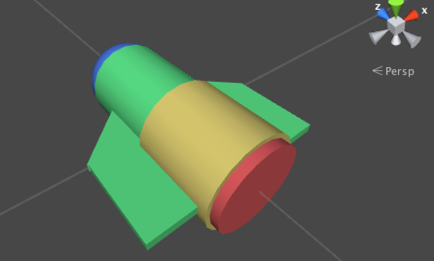
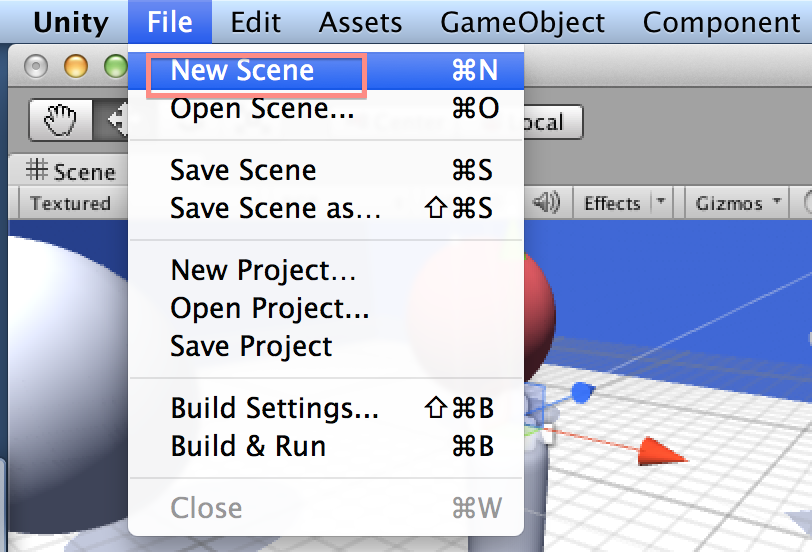
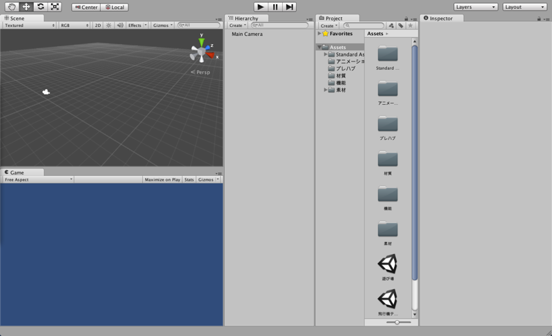
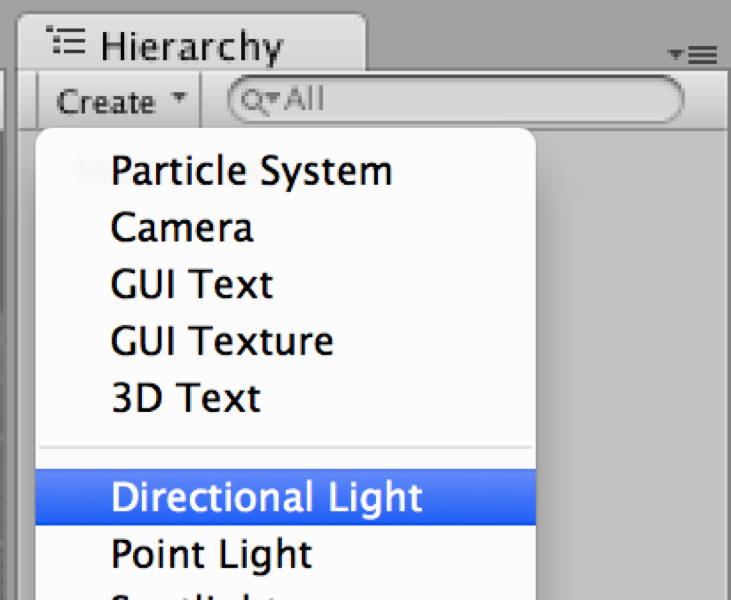
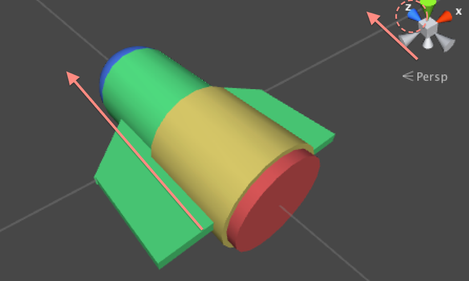
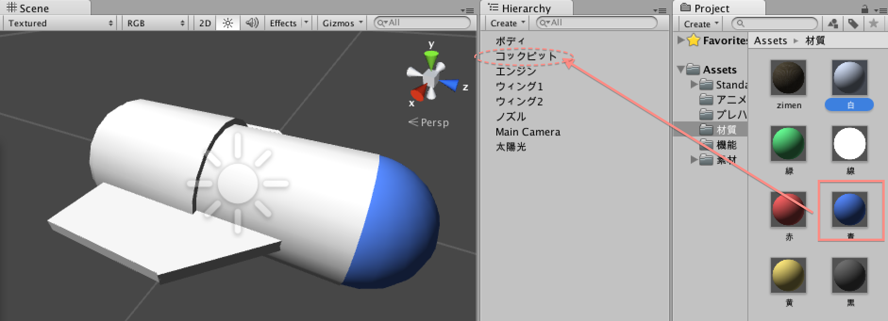
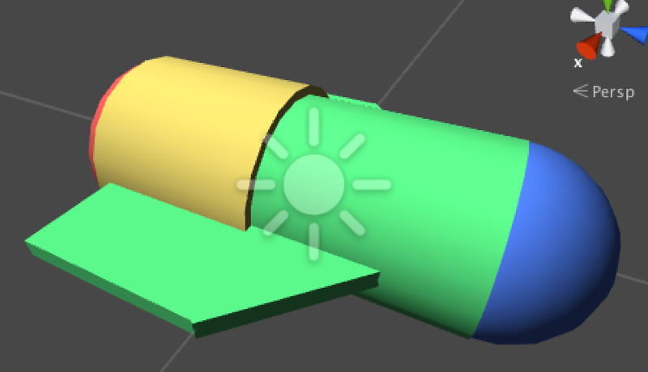
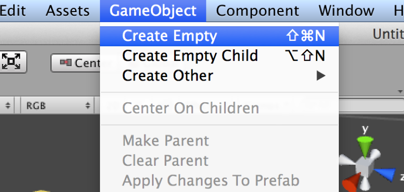
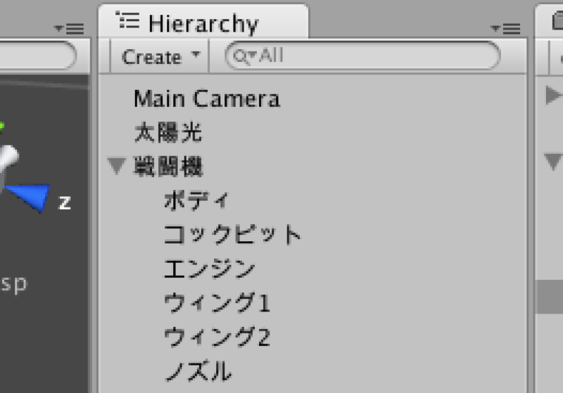

#戦闘機モデルを作ろう

さて、今までの操作を使って簡単なモデルを作成してみましょう。本来はUnityではなく専用のモデリングツールを使用したり、アセットストアからデータをダウンロードするのが一番良いのですが、今回は練習も兼ねて作成します。

##新しいシーンを作成する

説明していませんでしたが、今までは「遊び場」のシーンで作業を行ってきました。シーンとは、仮想空間の単位です。遊び場のシーンで継続して作成しても良いのですが、既に色々と物があり若干ややこしくなっているので、新しくシーンを作成します。

シーンを作成するには、以下の操作を行います。

*  メニューバー(エディタ上のバー)のFileを選択
*  New Sceneを選択

選択時にダイアログが表示される事があります。これは「遊び場シーンを変更したけど保存しとく？」の意味です。今回は不要なので、「Don't Save(セーブなんてしない)」を選択します。

シーンを新しく作成すると、HierarchyViewにカメラだけのシーンが作成されます。

作成したら次は保存しましょう。シーンを保存するには、以下の操作を行います。

*  メニューバーのFileを選択
*  Save Scene... を選択

最初の保存時はファイル名前を聞かれます。今回は「戦闘機モデリング.unity」とします。

###太陽光を作成

戦闘機を作成する前に、太陽光を作成しておきます。これが無いと、暗くて作業ができません。太陽光を作成するには、以下の操作を行います。

*  HierarchyのCreateを選択
*  Directional Lightを選択

Directional Lightが作成されますので、名前を「太陽光」としておきましょう。

作業を行ったら、Scene Saveでシーンを保存して下さい。エディタがクラッシュする事もありますので、こま目なセーブを心がけて下さい。

##戦闘機を作成する

戦闘機を作成します。

###モデルを作成

戦闘機モデルを作成します。今回は手間を考えかなり簡単なモデルとなります。皆さんなら、もっと良い物が作れると信じていますので、今まで覚えた手順を使ってより格好良くして下さい。

一点注意点として、戦闘機モデルはSceneViewでz軸方向（SceneView右上の青い矢印が向いている方向）を前として下さい。また、この説明文で「***を作成して下さい」といった場合、HierarchyのCreateから作成する操作です。また、指示のない値は変更せずそのままの値を使用します。

*  Cylinderを作成し、position（x:0, y:0, z:0）のrotation(x:90, y:0, z:0) に設定。名前を「ボディ」とします。
*  Sphereを作成し、position(x:0, y:0, z:0)に配置　scaleを(x:0.98, y:0.98, z:0.98)に設定。名前を「コックピット」とします。
*  Cylinderを作成し、position(x:0, y:0, z:-0.6)、rotationを(x:90, y:0, z:0)、scaleを(x:1.1, y:0.5, z:1.1)とします。名前は「エンジン」とします。
*  Cubeを作成し、position(x:0, y:0, z:-0.5)、scaleを(x:2.1, y:0.1, z:1)とします。名前を「ウィング1」とします。
*  Cubeを作成し、positionを(x:0, y:0, z:0)とし、rotationを(x:0, y:45: z:0)、Scaleを(x:1.5, y:0.1, z:1.5)とします。名前を「ウィング2」にします。
*  Cylinderを作成し、positionを(x:0, y:0, z:-0.7)とし、Rotationを(x:90, y:0, z:0)、Scaleを(x:1, y:0.5, z:1)とします。名前は「ノズル」にします。

.png)

##色を設定

作成したモデルに色を設定します。

Unityで色を塗るには、マテリアル（材質）を使用します。色を変更するには、ProjectViewの「材質」より、指定の色を選んでオブジェクトへドラッグ＆ドロップします。

*  まずはコックピットを青く塗りましょう。ProjectViewのAssets>材質を開きます。
*  青い玉(青.mat)を選択し、Hierarchyの「コックピット」へドラッグ＆ドロップします。

これでコックピットが青く塗られました。続けて他の色も設定していきます。

*  ボディ・ウィング１・ウィング２を「緑」に塗る
*  エンジンを「黄」に塗る
*  ノズルを「赤」に塗る

##親子構造を作成する

戦闘機を作成しましたが、現状だとオブジェクトを動かすのが非常に面倒です。なので、１個のオブジェクトから動かせるように設定し、かつ簡単に量産可能にします。

まずは動かしやすくするため、戦闘機モデル達の親オブジェクトを設定します。こうする事で、親オブジェクトを動かした際に子オブジェクトも一括で動かすことが出来ます。

手順は以下のとおりです。

*  メニューバー(上のメニュー一覧)のGameObjectを選択します。
*  Create Empty（何の機能も無いGameObject）を選択します。名前は「戦闘機」とします。
*  「戦闘機」オブジェクトのpositionを(x:0, y:0, z:0)とします。
*  先ほど作成した「ボディ」「コックピット」「エンジン」「ウィング１」「ウィング２」「ノズル」をCtrlキーを押しながら選択し、HierarchyViewの「戦闘機」オブジェクトへドラッグ＆ドロップします。

HierarchyViewの「戦闘機」オブジェクトの隣に▼が追加され、親子構造が作成されます。ではゲームを実行し、「戦闘機」オブジェクトの座標を動かしてみて下さい。　一斉にオブジェクトが動く事が確認出来ます。

この際、SceneViewからオブジェクトを選択すると「戦闘機」オブジェクトではなく、選択したオブジェクトが動いてしまう事があります。戦闘機を動かす際はHierarchyから選択するように心がけて下さい。

##プレハブ化する

戦闘機をプレハブ化します。プレハブとは、オブジェクトの雛形のような物で、これを上手く使う事でオブジェクトを簡単に量産可能にします。

今回は「戦闘機」をプレハブ化します。プレハブ化する手順は以下のとおりです。

*  HierarchyViewの「戦闘機」オブジェクトを選択し、ProjectViewのAssets/プレハブにドラッグ＆ドロップする

成功すると、「戦闘機」オブジェクトの文字が青くなり、プレハブフォルダ以下に「戦闘機」オブジェクトが作成されます。

次に、プレハブから戦闘機オブジェクトを作成しましょう。

*  ProjectViewのAssets/プレハブの「戦闘機」オブジェクトをHierarchyViewへドラッグ＆ドロップする。

これで「戦闘機」オブジェクトが簡単に量産可能になりました。

