#走るゲームを作ろう

まずは、このゲームを作るためのパッケージを追加します。

まずはどんなゲームを作るのか、実際にプレイして確認してみましょう。

*  BoxUnity-chan-DASH.unitypackage をダブルクリックしてファイルをインポートします。
*  次に、TEMPRUNデモ.unity を開きます。

ゲームを再生するとプレイヤーが前に向かって走り出します。ジャンプとスライディングで障害物を避けながら走りぬいて下さい。

プレイ方法は以下のとおりです。

*  上キー：ジャンプ
*  下キー：スライディング

#  テンプレートの読込

ひと通りゲームの感触がつかめたら、実際に作成していきましょう。
まずはテンプレートを読み込みます。

*  ProjectViewのAssets/TEMPRUNデモをダブルクリックします。

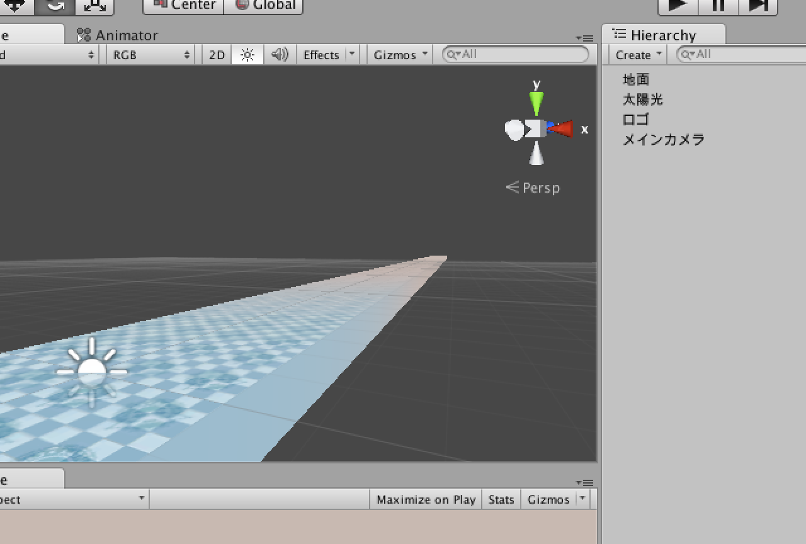

#モデルの配置

まずは走るモデルをコース上に配置します。

*  Assets/モデル/BoxUnityChanをHierarchy Viewへドラッグ＆ドロップします。

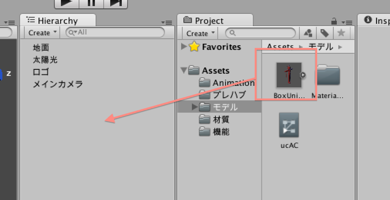

少し地面に埋まるかもしれませんので、座標を調整しておきましょう。

BoxUnityChanを選択し、position(x:0, y:0, z:0) へ移動します。この高さなら丁度足が地面につくはずです。

#走らせよう

次にモデルを走らせます。

*  ProjectViewの「Assets/モデル/ucAC」をユニティちゃんにドラッグ＆ドロップします。

再生すると、ユニティちゃんが走るモーションを行うようになります。しかし、その場でバタバタ足を動かすだけで移動しません。

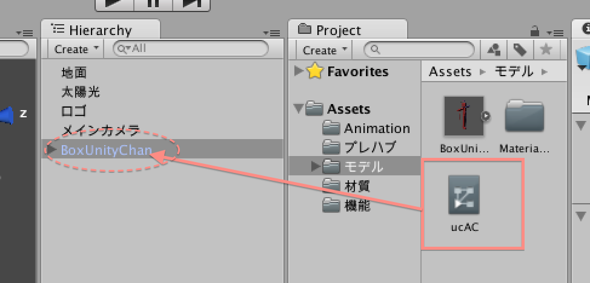

移動する機能を追加しましょう。

*  ProjectViewの「Assets/機能/走る」をボックスユニティちゃんへドラッグ＆ドロップします。

これで走るようになりました。

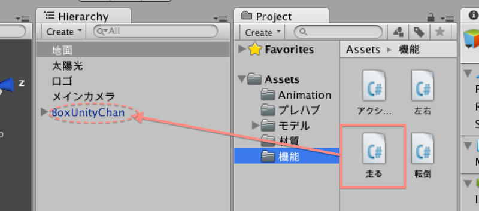

しかし、カメラの位置が固定のため「あ」っと言う間に話されてしまいます。今回は親子構造でカメラが追跡するようにします。

*  HIerarchyViewのメインカメラを選択し、BoxUnityChanへドラッグ＆ドロップします。

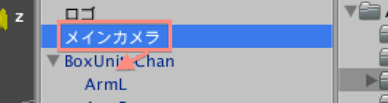
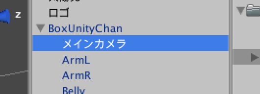

#障害物を配置する

障害物を配置しましょう。作り方は覚えていますか？

*  HierarchyViewのCreateを選択します。
*  Cubeを選択してキューブを作成し、名前をLOWへ変更します。
*  座標を、position(x:0, y:0.25, z:10)、大きさ scaleを(4, 0.5, 0.1) とします。

色も変更しましょう。

ProjectViewのAssets/材質/LOW（オレンジ色の玉）を選択して、先ほど作成したLOWオブジェクトへドラッグ＆ドロップしましょう。

ついでに、高い位置に配置する障害物も作成しましょう。

*  HierarchyViewのCreateを選択します。
*  Cubeを選択してキューブを作成し、名前をLOWへ変更します。
*  座標を、position(x:0, y:1, z:15)、大きさ scaleを(4, 0.5, 0.1) とします。
*  ProjectViewのAssets/材質/HIGH(緑)をドラッグ＆ドロップして色を塗ります。

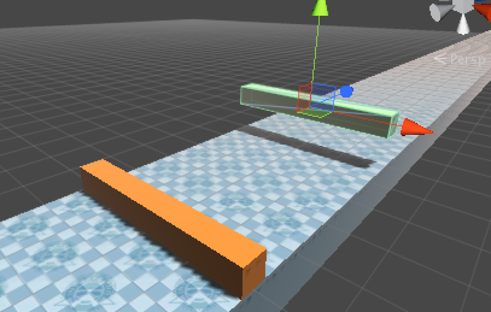

ゲームを再生しましょう。

残念ながら、障害物に当たる事無く貫通してしまいました。何故かと言えば、ボックスユニティちゃんに当たり判定が設定されていないからです。

#当たり判定を設定する

先ほどから作成してきたポリゴンと異なり、モデルを使用する場合は当たり判定を自分で設定する必要があります。

当たり判定を設定は以下の手順で行います。

*  HierarchyViewのBoxUnityChanを選択します。
*  InspectorViewのAddComponentボタンを押します。
*  一覧からPhysicsを選択し、Capsel Colilderを選択します。

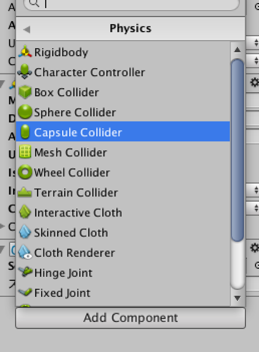

当たり判定を設定しましたが、少し判定が下に抜けています。これを調整しましょう。
なお、SceneViewのBoxUnityChanを選択中にSceneViewに見える緑色の線が、当たり判定の範囲です。

*  Capsel ColliderのCenterを (x:0, y:0.75, z:0)に設定、 Radiusを0.3、Heightを1.5にします。

再生してみましょう。障害物で停止しましたか？

#アクションを行う

障害物を乗り越えるアクションの制御を追加します。

まずはアクションの動作を確認しましょう。

先ほど走るアニメーションを追加しましたが、実はその中にはスライディングとジャンプのアクションが含まれています。さっそく内容を確認してみましょう。

*  HierarchyViewのBoxUnityChanを選択
*  InspectorViewのAnimatorのucACをダブルクリック

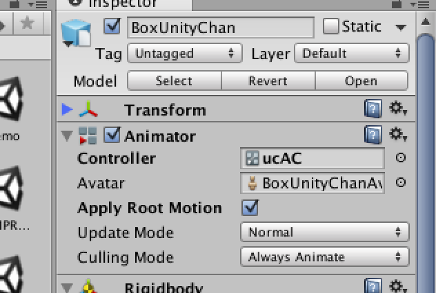

すると、AnimatorViewが表示されます。再度HierarchyViewのBoxUnityChanを選択し、ゲームを再生してみましょう。何かバーが動いているのが分かりますか？このバーは、現在再生中のアニメーションを表しています。

では、その状態でParametersのSLIDEもしくはJUMPの隣のチェックを押してみましょう。連動して動くバーの位置が変化しているのが分かります。また、ボックスユニティちゃんの挙動も変化します。
ボックスユニティちゃんがジャンプもしくはスライディングを行いましたか？

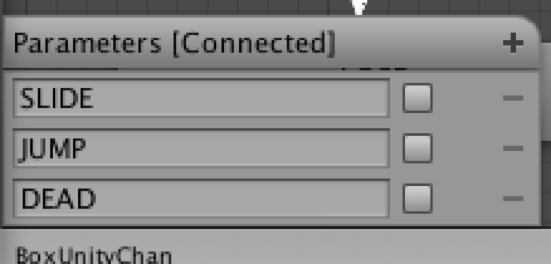

では、その動作をキーボードから行えるようにしましょう。今回追加するスクリプトは、チェックを入れる作業をキー入力から行います。

*  ProjectViewの「Assets/機能/アクション」をBoxUnityChanへドラッグ＆ドロップします。

ゲームを再生してみてください。上下キーでジャンプ・スライディングを行うようになりました。

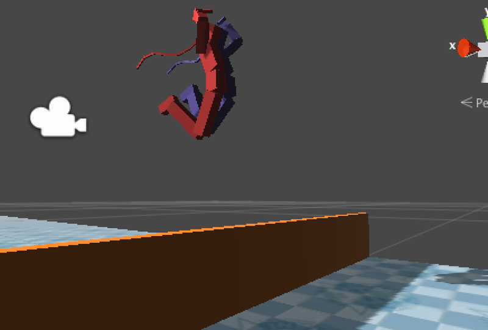

#障害物をすり抜ける

アニメーションでジャンプ・スライディングを行いますが、障害物に接触していて進めません。実は今はアニメーションが動いても当たり判定は動かない設定になっています。
これでは進めないため、ジャンプ中・スライディング中は当たり判定のみを残してすり抜けるような設定を行います。

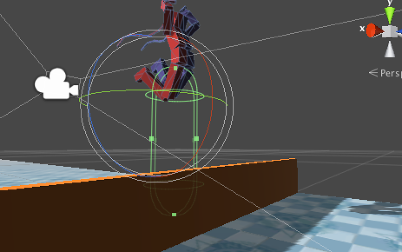

貫通出来るようにするには、Is Triggerの項目にチェックを入れます。実際にやってみましょう。

*  HierarchyViewのLOWオブジェクトを選択する。
*  Box ColliderのIs Triggerにチェックを入れる。

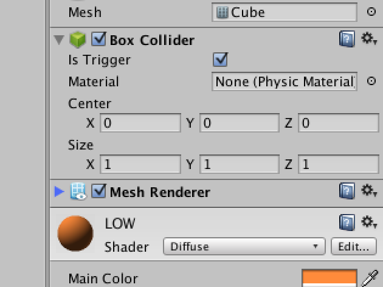

再生してみてください。LOWは貫通するようになりました。同様の手順でHIGHも貫通可能にします。

*  HierarchyViewのHIGHオブジェクトを選択する。
*  Box ColliderのIs Triggerにチェックを入れる。

#障害物に当たったら転倒する

障害物に接触したら転倒するようにします。

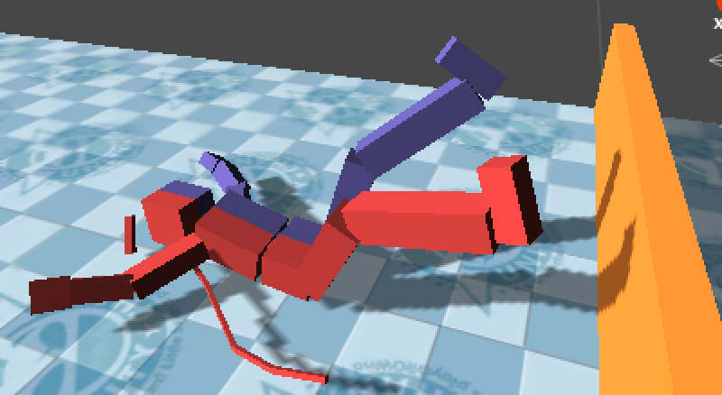

また、この機能にはジャンプ中はLOW・スライディング中はHIGHオブジェクトに接触しても無視する機能を追加してあります。

実際に追加してみましょう。

*  ProjectViewの「Assets/機能/転倒」をHIerarchyViewの「BoxUnityChan」へドラッグ＆ドロップします。

再生してみましょう。LOWはジャンプで、HIGHはスライディングで回避出来る事が確認出来ます。この機能では、名前で接触対象を判断して当たり判定を無視しています。

#自分だけのステージを作る

最後に自分だけのステージを作ってみましょう。
ステージを作る際は、障害物の名前に注意して下さい。

ステージが物足りない人の為に、左右移動も用意しました。このコンポーネントを追加する事で左右に移動することが可能になります

*  ProjectViewの「Assets/機能/左右」を「BoxUnityChan」へドラッグ＆ドロップ。

また、実はLOWとHIGHの他にWALLという名称の設定があり、これに接触するとジャンプ中・スライディング中に関わらず転倒する設定があります。

うまく活用して面白いゲームを作ってみてください。

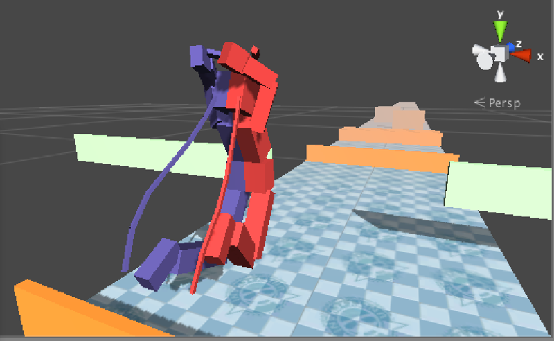