#障害物を避けるゲームを作ろう

さて、今まで作ってきた事・覚えたことを使って簡単なゲームを作りましょう。

作成する前にゲームをプレイしてみましょう。ProjectViewのAssets/飛行機デモ.unityをダブルクリックでシーンを開きゲームを再生する事で、事前に作成しておいたでもゲームをプレイ出来ます。この際ダイアログで保存の有無を聞かれるかもしれません。保存しておきましょう。

このゲームでは、以下のことを行えます。

*  飛行機が常に前進する
*  十字キーで上下左右へ移動する
*  障害物に接触しないようにゴールまで移動する

なお、上に隙間があるように見えますが「見えない壁」が置いてあります。
ゴールまで行ってもクリア等は発生しませんが、洞窟を突破してみてください。

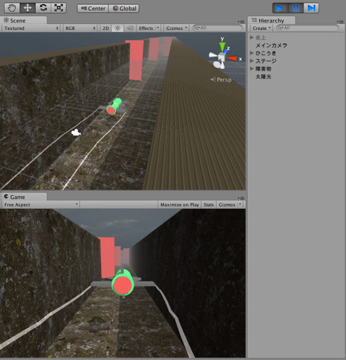

##シーンの作成

ひと通り遊んだら、実際にステージを作成してみましょう。
ステージは雛形シーンを用意したので、それを使用して作成します。まずはテンプレートから自分のシーンを作成しましょう。

*  ProjectViewのAssets/飛行機テンプレート.unity をダブルクリックで開きます。
*  メニューバーのFileを選択します。
*  Save as... を選択し、ステージ1.unity の名前で保存します。

これで、洞窟があるステージが作成されました。このステージにプレイヤー・障害物を配置して行きましょう。

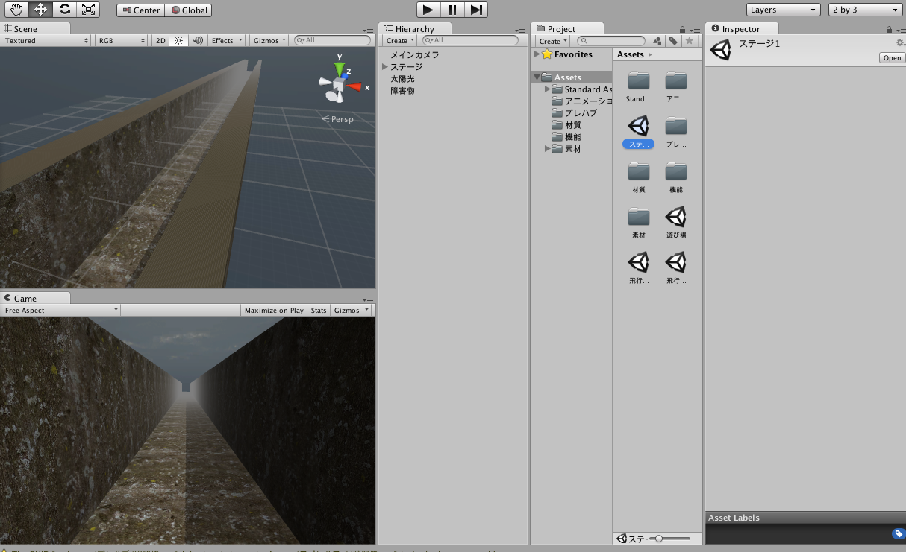

##プレイヤーの配置

ステージ1に先ほど作成した「戦闘機」オブジェクトを配置します。手法は先ほど同様です。

*  Assets/プレハブ/戦闘機を選択し、HierarchyViewへドラッグ＆ドロップ

次に、この戦闘機に挙動を追加します。まずは、常に前進させましょう。本来であればココでプログラミングの出番なのですが、今回はデモで使われているスクリプトを流用します。「前進」コンポーネントを追加します。コンポーネントの追加方法は覚えていますか？

*  HierarchyViewの「戦闘機」オブジェクトを選択します。
*  InspectorViewでAddComponentボタンをクリックします。
*  一覧の中からScriptsを選択し、「前進」を選択します。

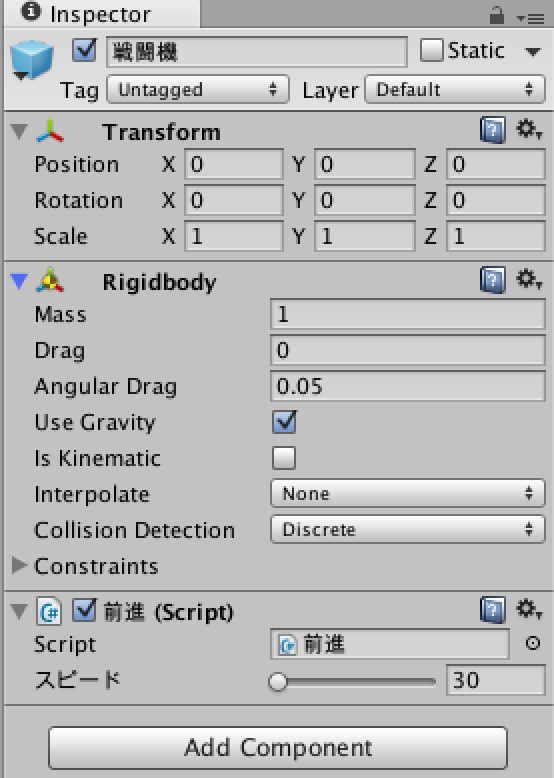

ゲームを再生してみてください。すごい勢いで戦闘機が前に飛んでいきます。特にGameViewから見ると、あっと言う間に豆粒のような大きさになってしまいました。
次はカメラがプレイヤーを追跡するようにします。

*  HierarchyViewの「メインカメラ」を選択します。
*  InspectorViewのAddComponentボタンをクリックします。
*  一覧の中からScriptsを選択し、「おっかけカメラ」を選択します。
*  おっかけカメラの「ターゲット」のNone(Transform）の項目に、HIerarchyViewの「戦闘機」オブジェクトをドラッグ＆ドロップします。

ゲームを再生してみてください。カメラが戦闘機を追っかけるのが分かります。

##左右の移動とクラッシュする機能の追加

前進だけでなく上下左右に動くようにします。
今度は上下左右に動かすコンポーネント「上下左右」を「戦闘機」オブジェクトに追加します。

*  HIerarchyViewの「戦闘機」オブジェクトを選択します。
*  InspectorViewのAddComponentボタンをクリックします。
*  一覧の中からScriptsを選択し、「上下左右」を選択します。

またゲームを再生してみてください。今度は上下左右に動けるようになりました。

次はオブジェクトと接触時にクラッシュし、操作不能になるように設定します。クラッシュする機能は「クラッシュ」コンポーネントが持っています。早速追加しましょう。

*  HIerarchyViewの「戦闘機」オブジェクトを選択します。
*  InspectorViewのAddComponentボタンをクリックします。
*  一覧の中からScriptsを選択し、「クラッシュ」を選択します。

ゲームを再生し、上下左右の壁に激突してみてください。戦闘機は力なく墜落します。

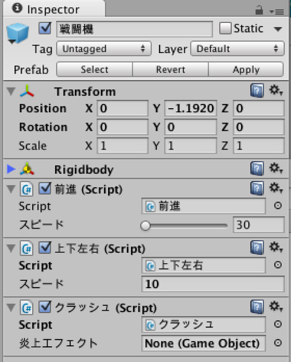

##障害物を配置する

準備は出来ました。障害物を配置しましょう。CubeやSphereオブジェクトの作り方は覚えていますか？　
例としていくつか作成します。
(作成したオブジェクトはプレハブに設定しておくと、後々ステージ作成が楽になるかもしれません)

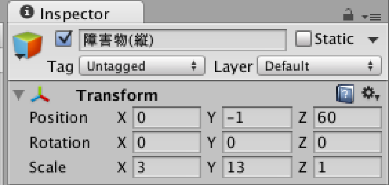

障害物(縦)

*  HIerarchyViewのCreateを選択します。
*  Cubeを選択し作成、Transformの値を position(x:0, y:-1, z:60)、Scaleの値を(x:3, y:13, z:1)とします。
*  Cubeの名前を「障害物(縦)」に変更します。
*  ProjectViewのAssets/材質から「赤」を選択し、障害物へドラッグ＆ドロップします。

障害物(横)

*  HIerarchyViewのCreateを選択します。
*  Cubeを選択し作成、Transformの値を position(x:0, y:-1, z:75)、Scaleの値を(x:13, y:3, z:1)とします。
*  Cubeの名前を「障害物(横)」に変更します。
*  ProjectViewのAssets/材質から「赤」を選択し、障害物へドラッグ＆ドロップします。

障害物(縦広)

*  HIerarchyViewのCreateを選択します。
*  Cubeを選択し作成、Transformの値を position(x:3, y:2, z:85)、Scaleの値を(x:8, y:13, z:1)とします。
*  Cubeの名前を「障害物(縦広)」に変更します。
*  ProjectViewのAssets/材質から「赤」を選択し、障害物へドラッグ＆ドロップします。

障害物(横広)

*  HIerarchyViewのCreateを選択します。
*  Cubeを選択し作成、Transformの値を position(x:0, y:2, z:70)、Scaleの値を(x:13, y:8, z:1)とします。
*  Cubeの名前を「障害物(横広)」に変更します。
*  ProjectViewのAssets/材質から「赤」を選択し、障害物へドラッグ＆ドロップします。

#ゲームに要素を追加する

##動く障害物を作る

このままではとても簡単ですので、動く障害物を作成します。
この手順は若干厄介ですので、スキップしても問題ありません。

まずは動かすオブジェクトを用意します。
Animationは相対座標（子の座標は親との差）を使用するので、親オブジェクトを設定し動かします。

*  「障害物(縦)」（上記参照）を作成します。（この章では以降の障害物(縦)はこのオブジェクトの事を指します）
*  メニューバー>GameObject>Create Emptyで空のオブジェクトを作成し、名前を「動く障害物(縦)」に変更、position(x:0, y:-1, z:100)へ配置します。
* 「 障害物(縦)」を「動く障害物(縦)」の子オブジェクトとして、親子関係をもたせます。
* 「 障害物(縦)」の座標を、position(x:0, y:0, z:0)とします。

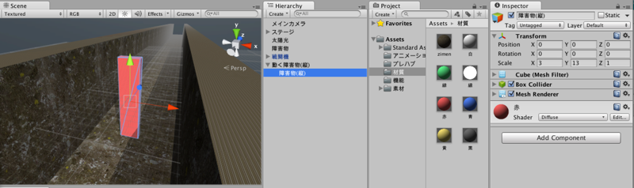

次にオブジェクトをAnimationで動かします。

*  「障害物(縦)」を選択し、InspectorViewのAddComponentから>miscellaneousを選択し、Animationを選択します。
*  メニューバーのWindowからAnimationを選択し、AnimationViewを選択します。
*  「障害物(縦)」を選択した状態で、AnimationViewの左上の「●」を選択、アニメーションファイル名が聞かれるので「左右@障害物(縦).anim」をAssets/アニメーションフォルダ以下に保存します。
*  まず、アニメーションの開始位置を設定します。AnimationViewの左上が赤丸になっている状態で、「障害物(縦)」の座標をposition(x:5.5, y:0, z:0)とします。
*  AnimationViewの赤い線を「1:00」まで移動し、この状態で「障害物(縦)」の座標をposition(x:-2, y:0, z:0)とします。
*  ProjectViewの「Assets/アニメーション/左右@障害物(縦).anim」を選択し、「障害物(縦)」へドラッグ＆ドロップします。

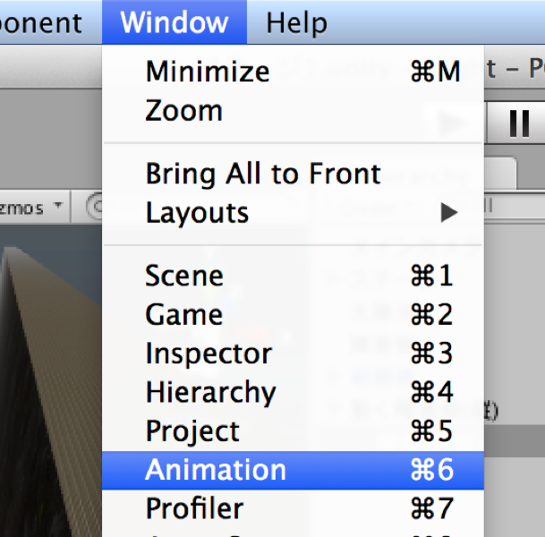

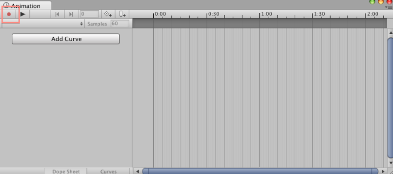

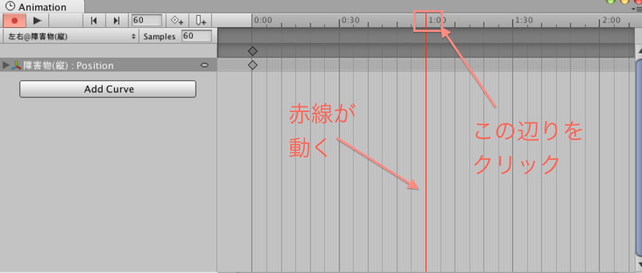

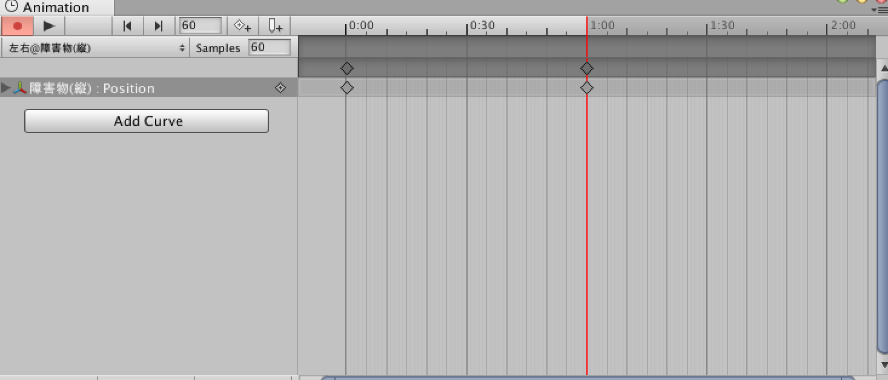

最後にループ（アニメーションが終わったら最初からやり直す）かピンポン（アニメーションが終わったら逆再生）かを選択します。今回はピンポンを選択。

*  ProjectViewの「Assets/アニメーション/左右@障害物(縦).anim」を選択し、InspectorViewで「ping pong」を選択します。

ゲームを再生してみると、「動く障害物(縦)」の「障害物(縦)」は左右に動いていることが分かります。

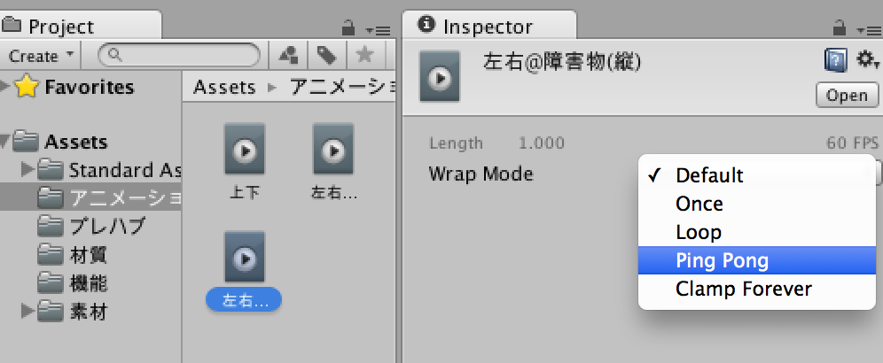

##炎上エフェクトを追加する

今回追加した「クラッシュ」コンポーネントには炎上エフェクトを管理する機能も追加されています。

使い方は以下のとおり

*  ProjectViewのAssets/プレハブ/炎上をHIerarchyViewへドラッグ＆ドロップし、シーンへ追加する。
*  HierarchyViewの「戦闘機」オブジェクトを選択する。
*  InspectorViewの「クラッシュ」コンポーネントの 「炎上エフェクト」へ、先ほどシーンへ追加した「炎上」オブジェクトをドラッグ＆ドロップする。

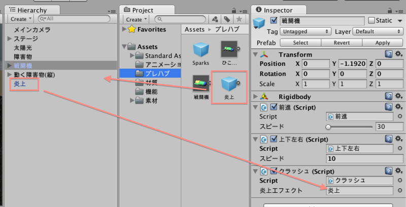

##ひこうき雲を追加する

翼の左右が空気を切るようなエフェクトを追加する。
とりあえず右翼のエフェクトを作成。

*  メニューバーのGameObject>Crate Emptyで空のオブジェクトを作成する。名前は「Line」とする。
*  作成したオブジェクトを「戦闘機」オブジェクトの子として配置する
*  Lineオブジェクトの座標をposition(x:1.05, y:-0.001, z:-1)へ移動する。
*  Add Componentボタンをクリック、一覧の中からEffectsを選択し、Trail Rendererを選択する。
*  Trail Rendererのパラメータの中の「Time」を0.3、「Start Width」「End Width」の値を全て0.1とする。
*  Trail Rendererのパラメータの中のMaterials > Element1へ、 Assets/材質/線.mat をドラッグ＆ドロップする。

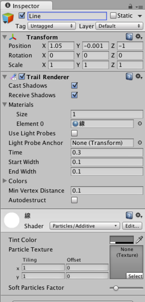

次に右翼用に作ったLineオブジェクトを元に左翼のLineオブジェクトも作成

*  Lineオブジェクトをコピー＆ペーストで同じオブジェクトを作成
*  新しく作成したLineオブジェクトの座標を、position(x:-1.05, y0.001, z:-1)とする。

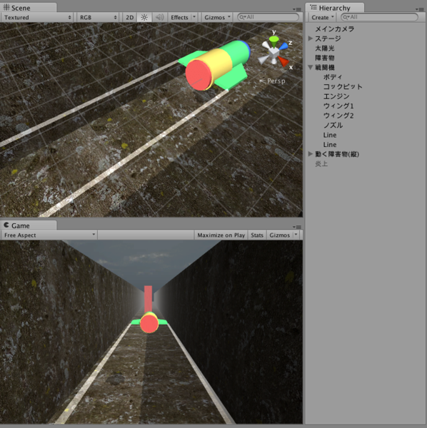

#君だけのステージを作ろう

これで障害物を避けるゲーム作成チュートリアルは終了です。
自分だけのステージを作ってみてください。