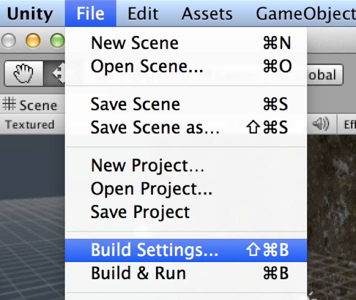
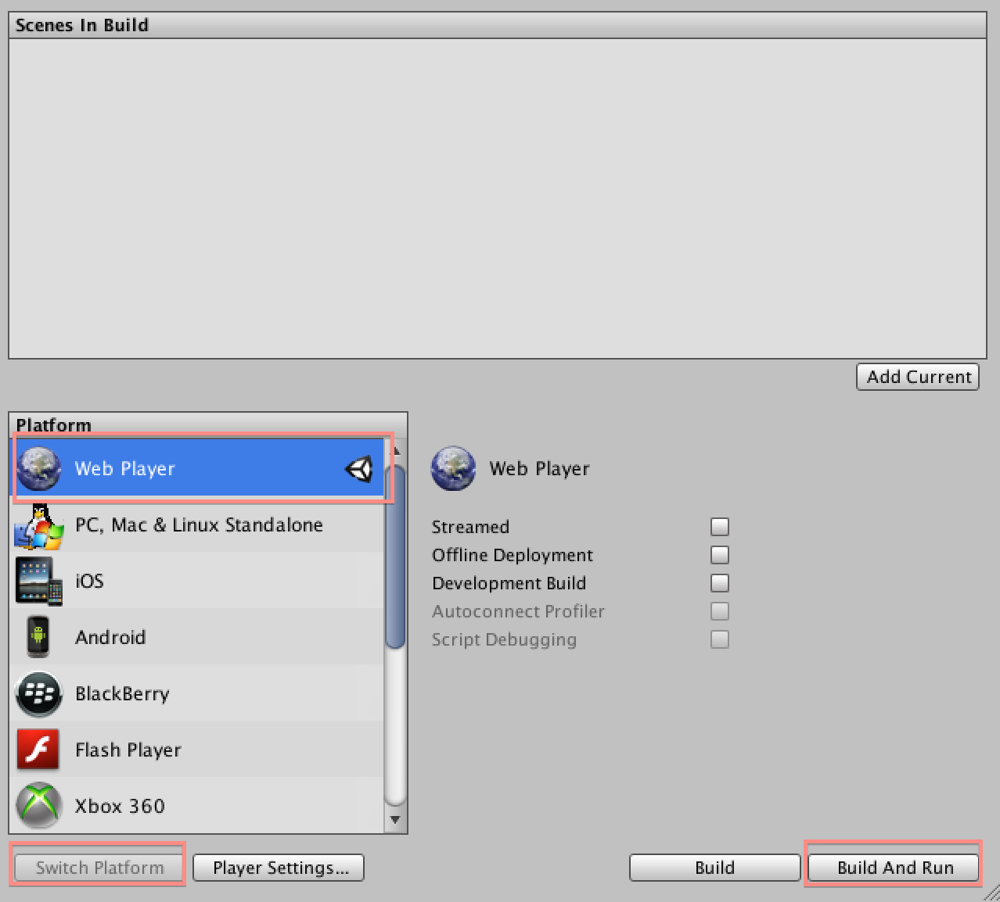
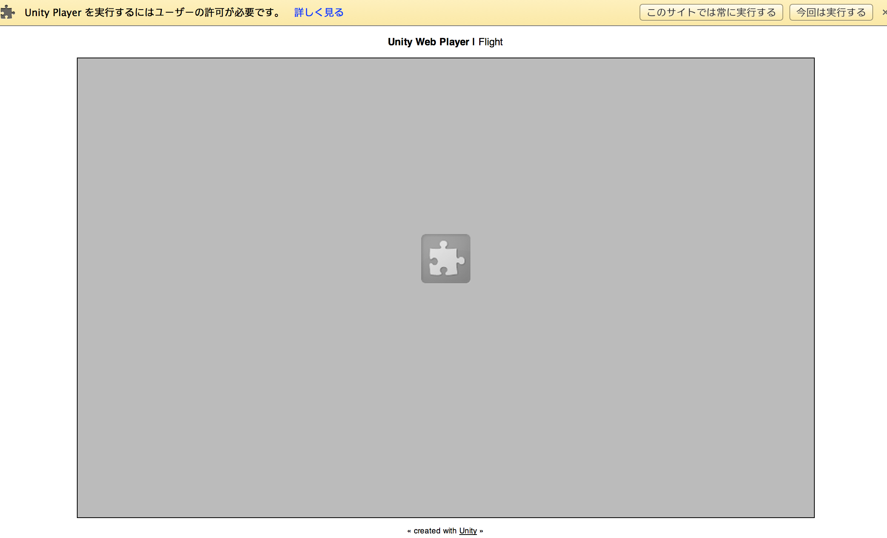

#ビルドしよう

ビルドとは、Unityエディタが無くてもプレイできるようにする事です。

UnityはiOS/Android/WebPlayer/PS4/Vita/Xbox one等々、様々なプラットフォームへ書き出しが可能です。今回は一番簡単なWeb Playerへの書き出しを行います。

*  メニューバーのFile>Build Settings...を選択します。
*  WebPlayerが選択されていない場合、Web Playerを選択して Switch Platformをクリックします。（この操作が出来なければスキップして構いません）
*  「Build and run」をクリックします。
*  ファイル名を聞かれた場合、「web」とします。

最近のブラウザでは、実行前に本当に実行してもよいか聞いてくるケースが有ります。その時は「このサイトでは常に実行する」を選択します。

上手く実行できない場合、google chromeをインストールしましょう。